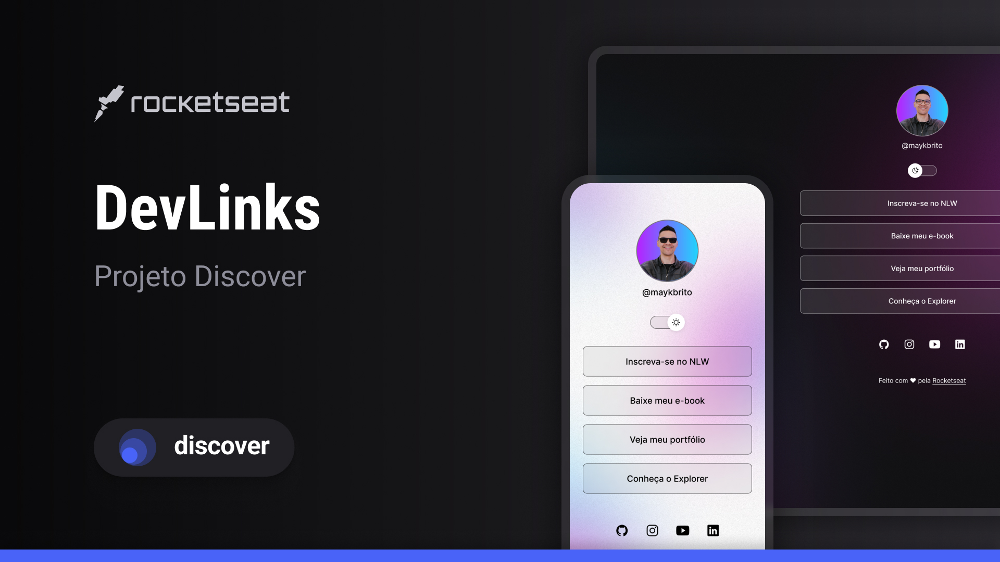

<h1 align='center'> LinkTree </h1>

Evento exclusivo e gratuito, promovido pela Rocketseat para ensino de tecnologias WEB.

    <a href='#-tecnologias'>Tecnologias</a> &nbsp;&nbsp;&nbsp; | &nbsp;&nbsp;&nbsp;&nbsp;
    <a href='#-projeto'>Projeto</a> &nbsp;&nbsp;&nbsp; | &nbsp;&nbsp;&nbsp;&nbsp;
    <a href='#-layout'>Layout</a> &nbsp;&nbsp;&nbsp; | &nbsp;&nbsp;&nbsp;&nbsp;
    <a href='#-memo-licença'>Licença</a>

    

 

    

## 🚀 Tecnologias

Esse projeto foi desenvolvido com as seguintes tecnologias:

- HTML e CSS
- JavaScript
- Git e Github
- Figma

## 🖥 Projeto

O LinkTree é um agregador de links para usar como cartão de visitas on-line.

## 📋 Layout

Você pode visualizar o layout do projeto através <a href='#'>desse link</a>. É necessário ter conta no <a href='#'>Figma</a> para acessá-lo.

## 📝 Licença

Esse projeto está sob a licença MIT.

##

Feito com ♥ by Rocketseat 👋
<a href='#'>Participe da nossa comunidade!</a>